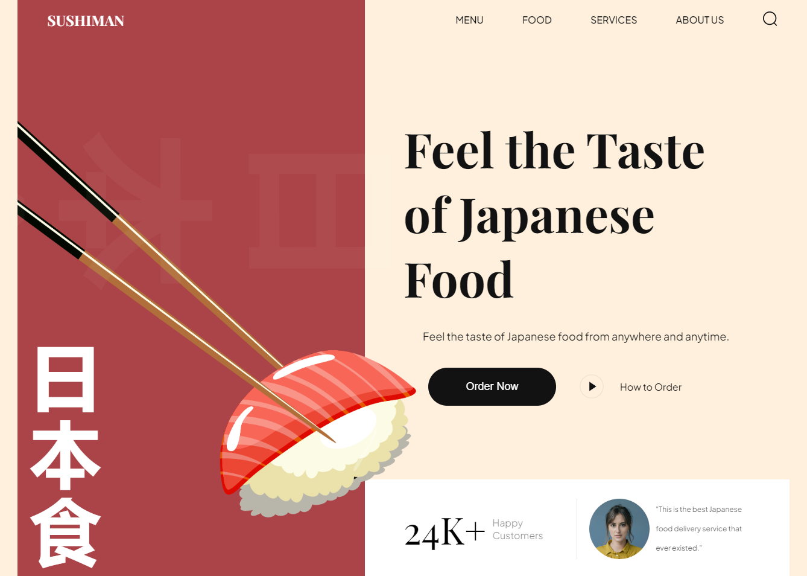

# Sushiman

Live: https://romnegrillo-sushiman.netlify.app/

Sushiman is a simple landing page project about sushi restaurant. Developed to practice the basics of web development using purely HTML and CSS only, with a focus on creating a visually appealing design and implementing a well-structured layout. The development process followed coding best practices. Proper semantic elements were used to enhance the accessibility and structure of the website. Includes the utilization of the BEM (Block, Element, Modifier) model for maintaining clean and maintainable CSS code. The website is designed to be mobile responsive, ensuring optimal viewing and usability across different devices.

## Setup

The project was bootstrapped with Vite with Vanilla JS. To set up the project locally, follow these steps:

- Clone the repository: `git clone https://github.com/romnegrillo/sushiman`
- Navigate to the project directory: `cd sushiman`
- Install the dependencies: `npm install`
- Start the development server: `npm run dev`
- Open your web browser and access the website at url that appears on your terminal.
